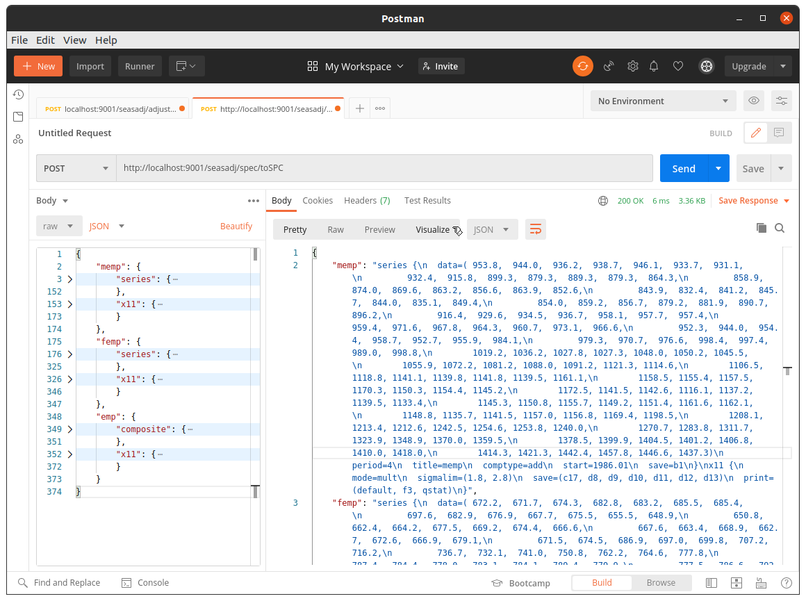

**Note.** This is very much a work in progress.  It hasn't been tested with particularly diverse inputs, and requires a fair few more unit tests, etc.  

## Overview

[X13-ARIMA-SEATS](https://www.census.gov/srd/www/x13as/x13down_unix.html) is a command-line program for the seasonal adjustment of time series data, written and maintained by the U.S. Census Bureau.  It is in widespread use, particularly among National Statistics Offices.  The main purpose of this library is to:

* provide a programmatic interface for running X13-ARIMA-SEATS
* provide a stateless microservice that can be used to run X13-ARIMA-SEATS remotely

The programmatic interface provides an abstraction that _may_ make it easier to use X13-ARIMA-SEATS in production pipelines and other workflows since there is no explicit use of the command line or filesystem, for example, and specifications can be built entirely programmatically.  Similarly for the microservice&ndash;in this case, any tool with an HTTP module can use the service, the only input required being a single JSON file.  The library was mainly written to support the creation of a JVM-based web service, however.

Of course, there are other incidental benefits provided here.  Specifically, being written in Scala, it is relatively easy to run adjustments concurrently, so large batch adjustments can be run faster.  Of course, under the hood X13-ARIMA-SEATS makes heavy use of physical files, so this is somewhat dependent on disk contention.

## Installation

The library is supplied as an [sbt](https://www.scala-sbt.org/) project.  To build a so-called fat jar, simply enter the project directory and run:

```bash
sbt assembly
```

This will yield a jar `target/scala-2.13/seasadj.jar` which contains everything required.  To use the library, simply include the jar file in your classpath.  To run the seasonal adjustment service, simply run:

```bash
java -cp seasadj.jar org.cmhh.seasadj.Service
```

And, of course, X13-ARIMA-SEATS itself must be present, and in the search path.  Specifically, the executable file `x13ashtml`.  This can be obtained from the following URL:

[https://www.census.gov/ts/x13as/unix/x13ashtmlall_V1.1_B39.tar.gz](https://www.census.gov/ts/x13as/unix/x13ashtmlall_V1.1_B39.tar.gz)

On a Linux platform, it is relatively easy to build X13-ARIMA-SEATS from source, and a utility script, [buildx13.sh](buildx13.sh), is provided which will do this, storing the resulting binary in `${HOME}/.local/bin`.

Alternatively, the service is easily containerised, and a simple example Dockerfile is included.  To build the container, ensure `seasadj.jar` is copied to the `docker` folder, and run:

```bash
docker build -t seasadj docker
```

To run the service via Docker, simply run:

```bash
docker run -td --rm --name seasadj -p 9001:9001 seasadj
```

As a further alternative still, a `Dockerfile` is also included in the root directory which can be also used to build a container which can be run in the same way as above.  This container differs in that the required jar file is built as part of the Docker build.  The build will take _much_ longer, but it is also easier for those without experience with sbt.  To build:

```bash
docker build -t seasadj .
```


## Overview X13-ARIMA-SEATS

To adjust a single series, we generally prepare at minimum a so-called specification file with extension `spc`.  For example, the following file, which is generally distributed with the X13-ARIMA-SEATS binary, is a complete example:

~~~{#airlinespc caption="testairline.spc"}
series{
  title="International Airline Passengers Data from Box and Jenkins"
  start=1949.01
  data=(
    112 118 132 129 121 135 148 148 136 119 104 118
    115 126 141 135 125 149 170 170 158 133 114 140
    145 150 178 163 172 178 199 199 184 162 146 166
    171 180 193 181 183 218 230 242 209 191 172 194
    196 196 236 235 229 243 264 272 237 211 180 201
    204 188 235 227 234 264 302 293 259 229 203 229
    242 233 267 269 270 315 364 347 312 274 237 278
    284 277 317 313 318 374 413 405 355 306 271 306
    315 301 356 348 355 422 465 467 404 347 305 336
    340 318 362 348 363 435 491 505 404 359 310 337
    360 342 406 396 420 472 548 559 463 407 362 405
    417 391 419 461 472 535 622 606 508 461 390 432)
  span=(1952.01, )
}

spectrum{
  savelog=peaks	
}

transform{
  function=auto
  savelog=autotransform  
}

regression{
  aictest=(td easter)
  savelog=aictest  
}

automdl{  
  savelog=automodel  
}

outlier{ }

x11{
  save=(d10 d11 d12)
}
~~~

The series could then be adjusted at the terminal by running:

```bash
x13ashtml testairline
```

Or, if we want to redirect the outputs:

```bash
x13ashtml -i testairline -o o/testairline
```

A metafile with extension `mta` can also be used to control input and output locations for an arbitrary number of input series.  In this case, in addition to the specification file we could create a metafile, `airline.mta`, as follows:

~~~{#airlinemta .bash caption="testairline.mta"}
<path>/testairline <path>/o/testairline
~~~

and we could then run the adjustment as follows:

```bash
x13ashtml -m testairline -s
```

Program output typically spans a number of individual files, saved in the same folder as the specification, or to a chosen output folder as indicated in the example above (the second entry on each line of a `mta` file).  The `-s` flag results in a file containing a range of summary measures and diagnostics being saved with a `udg` or `xdg` extension, depending whether an `X11` or `SEATS` adjustment specification is used.  The first few lines of the resulting `udg` file in this case look as follows:

~~~{#airlineudg caption="testairline.udg"}
date: Apr 17, 2020  
time: 15.18.00 
version: 1.1
build: 39
output: html
srstit: International Airline Passengers Data from Box and Jenkins
srsnam: testairline                                                     
freq:    12
span:  1st month,1952 to 12th month,1960
nobs:   108
constant:     0.0000000000E+00
transform: Automatic selection
nfcst:    12
ciprob:     0.950000
lognormal: no
mvval:     0.1000000000E+10
iqtype: ljungbox
samode: auto-mode seasonal adjustment
siglim:     1.500000     2.500000
adjtot: no
...
~~~

Most other output is expressed as a time series.  For example, the seasonally adjusted series, if requested, is saved in a file with either a `d11` or `s11` extension, depending whether an `X11` or `SEATS` adjustment is conducted.  In the case of the above example, the file looks as follows:

~~~{#airlined11 caption="testairline.d11"}
date	testairline.d11
------	-----------------------
195201	+0.192925972176234E+03
195202	+0.198588812698691E+03
195203	+0.185791217572829E+03
195204	+0.185841707777349E+03
195205	+0.186173988743725E+03
...
196008	+0.481457230370190E+03
196009	+0.482467666148965E+03
196010	+0.488648180079153E+03
196011	+0.490312020671497E+03
196012	+0.491205666986636E+03
~~~

## Seasonal Adjustment as a Service

The primary motivation here was to provide a simple wrapper for X13-ARIMA-SEATS, usable from any client with HTTP support.  Additionally, the adjustments themselves are completely stateless&ndash;we send data to the service, and the service responds with adjusted data, but the server does not retain either of the input or output.

### Adjusting a series

To adjust a series, we provide a JSON representation of our specification in the request body.  For example:

```bash
curl \
  -X POST \
  -H "Content-Type: application/json" \
  -d @examples/airline/airline.json localhost:9001/seasadj/adjust \
  --compressed --output -
```

The output will be relaively large, while still being quite readable.  For example, the above will yield output laid out as follows:

```json
{
  "airline": {
    "series": {
      "ador": {...},
      "ao": {...},
      ...
      "trn": {...},
      "xtrm": {...}
    },
    "diagnostics": {...}
  }
}
```

`series` contains all of the output produced by X13-ARIMA-SEATS that is a valid time series, and can be univariate or multivariate.  For example, the trend series will look as follows:

```json
"trn": {
  "date": ["1952.01", "1952.02", ...,"1960.11", "1960.12"],
  "value": [190.982678228513, 188.515085239703,... , 489.755759131541, 491.11387257342]
}
```

while regression factors will look as follows:

```json
"fct": {
  "date":["1961.01", "1961.02", ..., "1961.11","1961.12"],
  "value":[
    [442.417804625906,418.958393743495,467.19081601655],
    [412.125296290046,381.626024600631,445.062047379767],
    ...
    [420.602564274142,351.208361194933,503.708159088486],
    [477.081007063438,395.206825653025,575.916893450857]
  ]
}
```

`diagnostics` is an object containing key-value pairs for each summary or diagnostic measure found in the usual `xdg`/`udg` file.  Some diagnostics will be parsed into numeric arrays, but many will be left as strings.  For example, if the result was stored as an object called `ap`:

```javascript
> ap["airline"]["diagnostics"]["f3.qm2"]
0.18
```

Note the date representation can be made more compact by adding a query parameter `/?allDates=false`, in which case dates are represented by just the starting date and frequency (so, while smaller, clients will have to do some work to restore the full sequence if needed for plotting, for example).  For example, `trn` now looks as follows:

```json
"trn": {
  "start": "1952.01", "period":12,
  "value":[190.982678228513, 188.515085239703, ..., 489.755759131541, 491.11387257342]
}
```

Finally, we can omit series we are not interested in by adding a query paramter, `save`, which takes a comma separated list of series.  For example, to include onl the original (`ori`), trend (`trn`), and seasonally adjusted (`sa`) series, we'd add `/?save=ori,trn,sa`.  This reduces output size, but since each series must be read from a temporary file on the server, it also reduces the overall response time.  

### Batch adjustment

The adjustment service expects a JSON object, and that object can include any number of series&ndash;the earlier example just contained one.  But consider the following specification:

```json
{
  "memp": {
    "series": {
      "data": [953.8, 944.0, 936.2, 938.7, 946.1, 933.7, 931.1, 932.4, 915.8, 899.3, 879.3, 889.3, 879.3, 864.3, 858.9, 874.0, 869.6, 863.2, 856.6, 863.9, 852.6, 843.9, 832.4, 841.2, 845.7, 844.0, 835.1, 849.4, 854.0, 859.2, 856.7, 879.2, 881.9, 890.7, 896.2, 916.4, 929.6, 934.5, 936.7, 958.1, 957.7, 957.4, 959.4, 971.6, 967.8, 964.3, 960.7, 973.1, 966.6, 952.3, 944.0, 954.4, 958.7, 952.7, 955.9, 984.1, 979.3, 970.7, 976.6, 998.4, 997.4, 989.0, 998.8, 1019.2, 1036.2, 1027.8, 1027.3, 1048.0, 1050.2, 1045.5, 1055.9, 1072.2, 1081.2, 1088.0, 1091.2, 1121.3, 1114.6, 1106.5, 1118.8, 1141.1, 1139.8, 1141.8, 1139.5, 1161.1, 1158.5, 1155.4, 1157.5, 1170.3, 1150.3, 1154.4, 1145.2, 1172.5, 1141.5, 1142.6, 1116.1, 1137.2, 1139.5, 1133.4, 1145.3, 1150.8, 1155.7, 1149.2, 1151.4, 1161.6, 1162.1, 1148.8, 1135.7, 1141.5, 1157.0, 1156.8, 1169.4, 1198.5, 1208.1, 1213.4, 1212.6, 1242.5, 1254.6, 1253.8, 1240.0, 1270.7, 1283.8, 1311.7, 1323.9, 1348.9, 1370.0, 1359.5, 1378.5, 1399.9, 1404.5, 1401.2, 1406.8, 1410.0, 1418.0, 1414.3, 1421.3, 1442.4, 1457.8, 1446.6, 1437.3],
      "period": 4,
      "title": "memp",
      "comptype": "add",
      "start": 1986.01,
      "save": ["b1"]
    },
    "x11": {
      "mode": "mult",
      "sigmalim": [1.8, 2.8],
      "save": ["c17", "d8", "d9", "d10", "d11", "d12", "d13"],
      "print": ["default", "f3", "qstat"]
    }
  },
  "femp": {
    "series": {
      "data": [672.2, 671.7, 674.3, 682.8, 683.2, 685.5, 685.4, 697.6, 682.9, 676.9, 667.7, 675.5, 655.5, 648.9, 650.8, 662.4, 664.2, 677.5, 669.2, 674.4, 666.6, 667.6, 663.4, 668.9, 662.7, 672.6, 666.9, 679.1, 671.5, 674.5, 686.9, 697.0, 699.8, 707.2, 716.2, 736.7, 732.1, 741.0, 750.8, 762.2, 764.6, 777.8, 787.4, 784.4, 778.0, 783.1, 784.1, 789.4, 779.9, 777.5, 786.6, 792.5, 795.6, 796.6, 802.6, 816.5, 807.5, 802.8, 822.6, 838.4, 829.7, 840.6, 839.3, 864.8, 859.3, 865.0, 868.5, 886.1, 878.2, 885.6, 907.2, 918.4, 910.8, 906.7, 931.2, 960.8, 947.2, 953.9, 969.9, 977.3, 979.8, 988.6, 984.1, 991.0, 999.3, 1005.1, 997.0, 1027.7, 995.5, 1017.4, 1024.2, 1039.0, 1013.8, 1005.7, 1007.4, 1015.4, 1007.4, 1007.4, 1008.7, 1022.5, 1026.1, 1028.7, 1024.0, 1042.4, 1034.4, 1037.1, 1035.1, 1025.0, 1042.3, 1040.8, 1055.2, 1074.2, 1079.4, 1070.4, 1087.9, 1119.1, 1116.0, 1105.8, 1102.4, 1131.1, 1140.1, 1160.0, 1166.2, 1196.0, 1196.5, 1189.1, 1215.1, 1237.1, 1237.5, 1240.9, 1259.0, 1249.4, 1262.2, 1265.9, 1272.2, 1284.2, 1287.6, 1273.0, 1263.3],
      "period": 4,
      "title": "femp",
      "comptype": "add",
      "start": 1986.01,
      "save": ["b1"]
    },
    "x11": {
      "mode": "mult",
      "sigmalim": [1.8, 2.8],
      "print": ["default", "f3", "qstat"],
      "save": ["c17", "d8", "d9", "d10", "d11", "d12", "d13"]
    }
  },
  "emp": {
    "composite": {
      "title": "'emp'"
    },
    "x11": {
      "mode": "mult",
      "sigmalim": [1.8, 2.8],
      "print": ["default", "f3", "qstat"],
      "save": ["c17", "d8", "d9", "d10", "d11", "d12", "d13"]
    }
  }
}
```

This is a valid input containing 3 series, one of which is a composite (that is, the last of the 3 is a series implicitly defined by adding the first two), and the service will handle this just fine.

### Creating and validating inputs 

The service provides several endpoints that can be useful when working with specifications.  Specifically:

endpoint                     | function
-----------------------------|--------------------------------------------------------------------
`/seasadj/spec/validateSPC`  | Confirm if a text string is valid as a traditional SPC file or not.
`/seasadj/spec/validateJSON` | Confirm if a text string is valid as a JSON specification or not.
`/seasadj/spec/toJSON/:name` | Convert a SPC text string to a valid JSON specification.
`/seasadj/spec/toSPC`        | Convert a JSON specification to JSON object with several SPC text strings.

To test if the content of a SPC file is valid, we pass it to the `/seasadj/spec/validateSPC` endpoint.  A repsonse code of 200 should be returned with an appropriate message:


Similarly, to test a JSON string is a valid specification object we can use the `/seasadj/spec/validateJSON` endpoint:


We can convert the content of a single SPC file to JSON via the `/seasadj/spec/toJSON/:name` endpoint:


In this case, failure will yield a status code of 422 (Unproccessable Entity) if the provided SPC appears invalid, and 500 (Internal Server Error) if the adjustment otherwise fails.  

Finally, we can convert a JSON specifications object via the `/seasadj/spec/toSPC` endpoint.  In this case the output will be a JSON object containing content appropriate for a SPC file for each individual specification found:




## Libary Overview

Consider the following simple, but complete adjustment:

```
series{
  title="International Airline Passengers Data from Box and Jenkins"
  start=1949.01
  data=(112 118 132 129 121 ... ... 606 508 461 390 432)
  span=(1952.01, )
}

x11{}
```

Internally, the whole specification is modelled as a single class called `Specification`.  A `Specification` in turn is a data class consisting of a name and then nested maps containing the individual groups of paramaters.  In the case above, the name might be something like `airpassengers`, and the map member would contain the keys `series` and `x11`.  The value for `series` would be another map containing keys `title`, `start`, `data`, and `span`.  The value for `x11` would simply be an empty mapping.

The values themselves are all descended from an abstract class called `SpecValue`.  For example, in `start=1949.01`, `1949.01` is imported with type `SpecDate`.  Similarly, the right-hand side of the `data` argument is imported with type `SpecNumArray`, and `span` is imported with type `SpecSpan`.  Only certain types are permitted for certain parameters, and there is _some_ checking of correctness when constructing a `Specification`.  The validation is probably a little clumsy in its design, and is not complete.

Multiple specifications can be collected together to enable batch adjustments.  This is modelled as a single class called `Specifications` containing a single member, `specifications`, which is just a sequence of objects of type `Specification`.


## Mapping X13-ARIMA-SEATS Inputs

Consider the case where we wish to adjust two series: male and female employment; as well as indirectly adjusting total employment by way of a 'composite' adjustment.  We denote the three series in short as `memp`, `femp`, and `emp`, respectively.  The relevant specifications are as follows:

~~~{#mempspc caption="memp.spc"}
series{
  title="male employed"
  save=(b1)
  comptype=add
  data=(
    1206.7  1210.2  1208.6  1236.8
    1246.2  1244.2  1228.7  1258.3
    1270.5  1296.4  1307.7  1332.4)
  start=2014.01
  period=4
}

x11{
  mode=mult
  sigmalim=(1.8,2.8)
  save=(d8 d10 d11 d12 d13 c17)
}
~~~

~~~{#fempspc caption="femp.spc"}
series{
  title="female employed"
  save=(b1)
  comptype=add
  data=(
    1080.3  1071.4  1088    1119.3
    1114.8  1105.1  1100.7  1130
    1138.5  1157.9  1164.3  1194.5)
  start=2014.01
  period=4
}

x11{
  mode=mult
  sigmalim=(1.8,2.8)
  save=(d8 d10 d11 d12 d13 c17)
}
~~~

~~~{#empspc caption="emp.spc"}
composite{
  title="total employed"
  save=(isf isa itn b1 id8 iir)
}

x11{
  mode=add
  sigmalim=(1.8, 2.8)
  save=(e1 c17 d8 d9 d10 d11 d12 d13)
}
~~~

Finally, to run this in such a way that the total employed series, `emp`, is adjusted indirectly as the sum of male and female employment, we would require that the three series be adjusted together by using a metafile as follows:

~~~{#empmta caption="employment.mta"}
<path to spc>/memp <path to output>/memp
<path to spc>/femp <path to output>/femp
<path to spc>/emp  <path to output>/emp
~~~

For no other reason than JSON is seemingly near-universal in its use in web services, we create a service that accepts a single JSON string as input, and returns output as JSON also.  Of course, we can express an adjustment in this format without any loss of functionality, and we hope that the example given is general enough to convince us this is true.  At any rate, it should be clear that the following JSON representation is sufficient to represent the stated setup:

```json
{
  "memp": {
    "series": {
      "title": "male employed",
      "start": 2014.1,
      "period": 4,
      "data": [
        1206.7, 1210.2, 1208.6, 1236.8, 
        1246.2, 1244.2, 1228.7, 1258.3, 
        1270.5, 1296.4, 1307.7, 1332.4],
      "comptype": "add"
    },
    "x11": {
      "mode": "mult",
      "sigmalim": [1.8, 2.8]
    }
  },
  "femp": {
    "series": {
      "title": "male employed",
      "start": 2014.1,
      "period": 4,
      "data": [
        1080.3, 1071.4, 1088.0, 1119.3, 
        1114.8, 1105.1, 1100.7, 1130.0, 
        1138.5, 1157.9, 1164.3, 1194.5],
      "comptype": "add"
    },
    "x11": {
      "mode": "mult",
      "sigmalim": [1.8, 2.8]
    }
  },
  "emp": {
    "composite": {
      "title": "total employment"
    },
    "x11": {
      "mode": "mult",
      "sigmalim": [1.8, 2.8]
    }
  }
}
```

Here, we account for the metafile by including the series in the array in the same order.  We do not need the path information for the purpose of calling the service, though internally the service will handle this for us.  This will prove far more convenient in practice than the traditional setup&ndash;we have traded 4 files here for a single JSON file / string.  Actually, the rationalisation can be geater still.  It is not uncommon to provide the time series data for each series in separate files, and the path to the data as a parameter in the specification.  In this case, we would have had 6 input files (we do not need to provide data for composites).  In our case, we will require that the data always be present in the specification, and we forbid the use of separate files and paths.

## Mapping X13-ARIMA-SEATS Outputs

Internally, all adjustments are run with the `-g` flag, which means most tables are saved, as well as ensuring that diagnostics are written to an `xdg` or `udg` file.  Currently, the result of an adjustment is stored in a case class called `Adjustment` which has members `series` and `diagnostics`.  `series` is a collection containing all output that can be imported as a `TimeSeries` (irregular component, seasonally adjusted series, trend, etc.), while `diagnostics` is a hashmap containing all the measures found in the `xdg` or `udg` files&ndash;values are stored as numeric or integer scalars or arrays if possible, and strings otherwise.

## Programmatic Examples

The library is intended to be used either programmatically, or indirectly via a web service.  In this section we demonstrate simple examples of programmatic use.

### Importing a `spc` file

Consider again the air passengers example above.  While it is possible to construct examples entirely programmatically, limited convenience methods are provided.  For example, that example can be imported as follows:

```scala
import org.cmhh.seasadj._
val ap = Specification.fromFile("airpassengers", "testairline.spc").get
```

The `fromFile` method has a return-type of `Try[Specification]` meaning that it will return either `Success` or `Failure` as appropriate.  The call here is successful, and we append `.get` to retrieve the underlying value.  (This is for illustrative purposes only, and one would typically avoid the use of `get` in this way in practice).  The resulting object may or may not be directly adjustable, but if it is, one can adjust it as follows:

```scala
val res = Adjustor.adjust(ap).get
```

The `adjust` method will yield an object of `Try[Adjustment]`, again because adjustment might fail.  Assuming it is successful, the result will be an object of type `Adjustment`, which we extract using `get` which is, again, particularly bad form in practice.  Either way, a successful result contains the time series outputs collected into a list, and a hashmap of all the various diagnostics.  For example, to pull the overall quality measure:

```
scala> println(res.summary("f3.q"))
0.16
```

Or to look at the final seasonally adjusted data:

```
scala> println(res.results("sa").map((x: Double) => math.round(x * 10.0) / 10.0))
       jan   feb   mar   apr   may   jun   jul   aug   sep   oct   nov   dec
1952 192.9 198.6 185.8 185.8 186.2 192.6 187.6 200.2 200.7 208.3 211.9 217.1
1953 218.6 223.4 230.5 241.4 230.4 217.5 214.7 224.6 226.5 228.2 224.2 225.0
1954 224.1 215.0 234.3 233.4 235.6 236.4 241.7 243.2 246.5 245.9 255.2 257.2
1955 264.0 268.5 269.8 274.1 275.4 281.8 286.7 288.4 295.6 294.4 297.8 309.8
1956 311.4 312.4 316.6 325.2 328.9 329.9 327.1 332.0 328.9 335.0 340.3 339.8
1957 348.9 353.5 361.3 361.4 367.7 367.8 369.7 374.0 378.4 377.8 379.2 379.6
1958 377.9 376.3 370.9 361.9 371.9 383.5 387.3 396.0 383.4 389.2 381.2 387.4
1959 397.5 407.1 416.4 418.4 423.8 421.8 430.6 435.5 439.2 436.4 450.1 465.8
1960 457.1 453.0 444.4 472.5 480.0 477.9 477.4 481.5 482.5 488.6 490.3 491.2
```

### Importing a JSON file

A JSON file can contain one or more potential adjustments, and so JSON files will generally be imported as `Specifications`&ndash;there is no problem creating an object of type `Specifications` that contains just a single series.  To import and adjust a JSON file:

```scala
val foo: Try[Specifications] = Specifications.fromJSON("foo.json")
val bar: Try[Adjustments] = foo.flatMap(Adjustor.adjust(foo))
```

If uncomfortable with the use of `Try` (and if absolutely sure of a positive outcome), one could instead do something like:

```scala
val foo: Specifications = Specifications.fromJSON("foo.json").get
val bar: Adjustments = Adjustor.adjust(foo).get
```

### Working folder (`spc` and `mta` files)

A common way of working with X13-ARIMA-SEATS is to store a collection of time series and specifications in a single working directory, and run a batch adjustment using a `mta` file.  While it probably isn't practical to anticipate every possible setup, a simple utility is provided which will import the contents of a workding directory and output a single JSON file for each `mta` file contained therein, provided the following conditions are met:

* there is one or more `mta` files in the root directory
* there is one or more `spc` files in the root directory
* all files referenced in the spc files are somewhere below the root directory.

Given such a setup, one can then run:

```bash
java -cp seasadj.jar org.cmhh.seasadj.ImportInputs <input path> <output path>
```

Files will be matched up with `file` parameters in `spc` files as closely as possible (i.e. even if the full path does not match exactly), and the `file` parameters will generally be replaced with `data` parameters.  Essentially all files below root are recursively listed, the best match for a file referred to in a spec is the file with the longest matching sequence of characters from the end working backwards.

### Builder pattern

As noted, we can emulate the airline example above completely programmatically.  Of course, you wouldn't generally enter all the observations in a time series by hand, but, nevertheless:

```scala
val ap = Specification("airpassengers")
  .setParameter(
    "International Airline Passengers Data from Box and Jenkins",
    "title", "series"
  )
  .setParameter("1949.01", "start", "series")
  .setParameter(
    "(112.0, 118.0, 132.0, 129.0, 121.0, 135.0, 148.0, 148.0, ...)",
    "data", "series"
  )
  .setParameter("(1952.01,)", "span", "series")
  .setParameter("peaks", "savelog", "spectrum")
  .setParameter("auto", "function", "transform")
  .setParameter("autotransform", "savelog", "transform")
  .setParameter("(td easter)", "aictest", "regression")
  .setParameter("aictest", "savelog", "regression")
  .setParameter("automodel", "savelog", "automdl")
  .setSpec("outlier")
  .setParameter("(d10 d11 d12)", "save", "x11")
```

In this case, we create an empty `Specification`, and then use a builder pattern to successively add to it.  Methods such as `setParameter` and `setSpec` are factory methods that result in a new `Specification`, however, rather than modifying an existing one.  For example, in the following, `s2` is a `Specification` which is the result of adding a title to `s1`, but `s1` itself remains empty:

```scala
val s1 = Specification("foo")
val s2 = s1.setParameter("a title", "title", "series")
```

Parameters themselves are generally descended from the `SpecValue` abstract class.  The method `setParameter` will accept a string input and then construct the appropriate type as required.  For example, we set the value of `span` in the `series` spec above as follows:

```scala
ap.setParameter("(1952.01,)", "span", "series")
```

In this case, the string `(1952.01,)` is converted to an object of type `SpecSpan` before being added.  We could just as well have done this as follows:

```scala
ap.setParameter(
  SpecSpan(Some(Month(1952,1)), None),
  "span", "series"
)
```

`SpecSpan` is a case class consisting of a `start` and `end`, each of which is of type `Option[Date]` (`Option` because either, but not both, could be set to `None`).  

### Adjustment templates

Another approach one might take when adjusting series is to create functions that take a `TimeSeries` as input, and return `Specifications`.  Vanilla X11 and SEATS methods are provided for demonstrative purposes (and, of course, the builder pattern can still be used with such objects).  For example, to do a SEATS-style adjustment of the Box and Jenkins airline data:

```scala
val ap = Specification.Seats("airpassengers", data.airpassengers)
```

The full definition of the `Seats` method is as follows:

```scala
  /**
   * Create a basic [[Specification]] from a [[TimeSeries]]&ndash;SEATS variant.
   *
   * @param name name
   * @param data time series
   */
  def Seats(name: String, data: TimeSeries): Specification = {
    val (seriesData, seriesStart) = data.toSpecValue
    val seriesSpec: Spec = Map(
      "title" -> SpecString(name), 
      "data" -> seriesData, 
      "start" -> seriesStart
    )
    Specification(
      name,
      Map("series" -> seriesSpec, "seats" -> Map[String,SpecValue]())
    )
  }
```